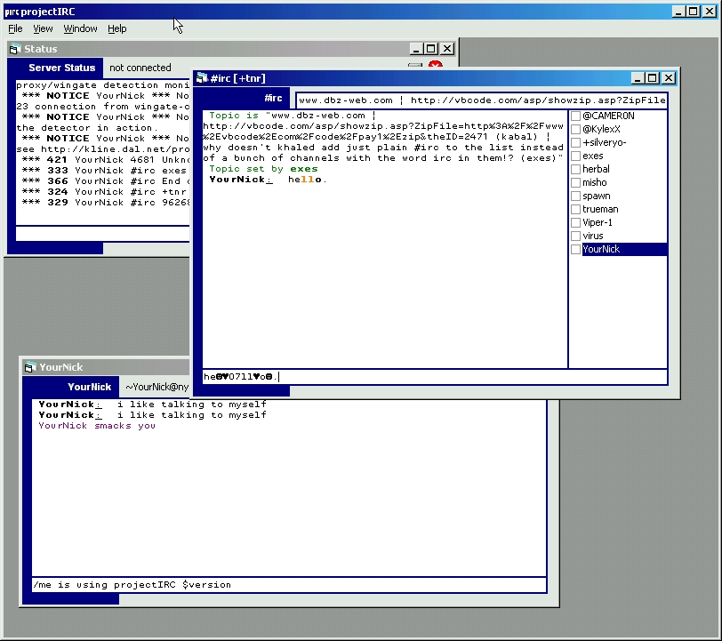



## projectIRC

### Description

Pretty functional IRC Client.

Includes support for channels and queries, up to 30 of each (can be changed for more). Supports color formatting (although it's still a little bit buggy). Supports a few aliases, /me, /quit, /msg, /query, /id, and built in variables, $server, $me, $port, $randnick, $chan, $version

Ex: /me is using projectIRC $version

Handles all joins, parts, kicks, quits, nick changes, mode changes correctly, as well as topic changes. Still being updated daily, far from being done. Please don't try to copy from me :)
 
### More Info
 
May be a little bit slow.

             |
---                |---
**Submitted On**   |2000-09-21 17:37:00
**By**             |[vcv](https://github.com/Planet-Source-Code/PSCIndex/blob/master/ByAuthor/vcv.md)
**Level**          |Intermediate
**User Rating**    |4.8 (24 globes from 5 users)
**Compatibility**  |VB 6\.0
**Category**       |[Complete Applications](https://github.com/Planet-Source-Code/PSCIndex/blob/master/ByCategory/complete-applications__1-27.md)
**World**          |[Visual Basic](https://github.com/Planet-Source-Code/PSCIndex/blob/master/ByWorld/visual-basic.md)
**Archive File**   |[CODE\_UPLOAD100549212000\.zip](https://github.com/Planet-Source-Code/vcv-projectirc__1-11600/archive/master.zip)

